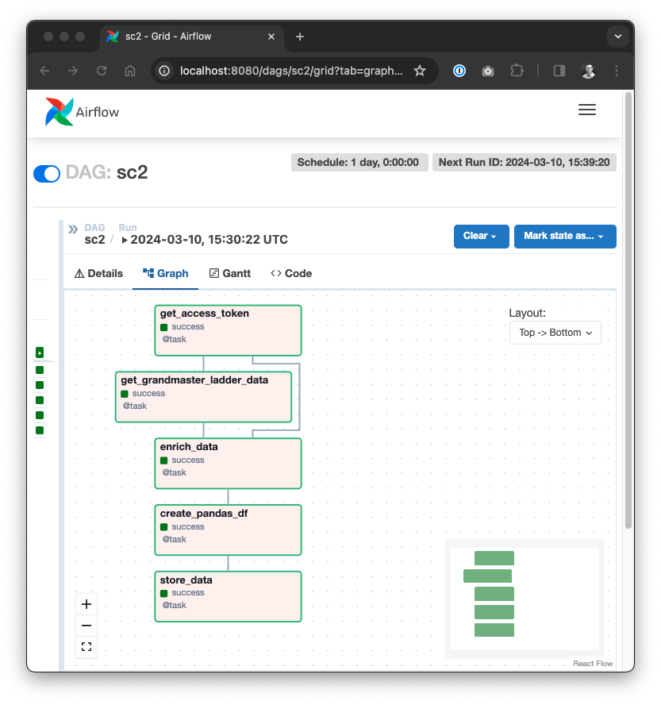
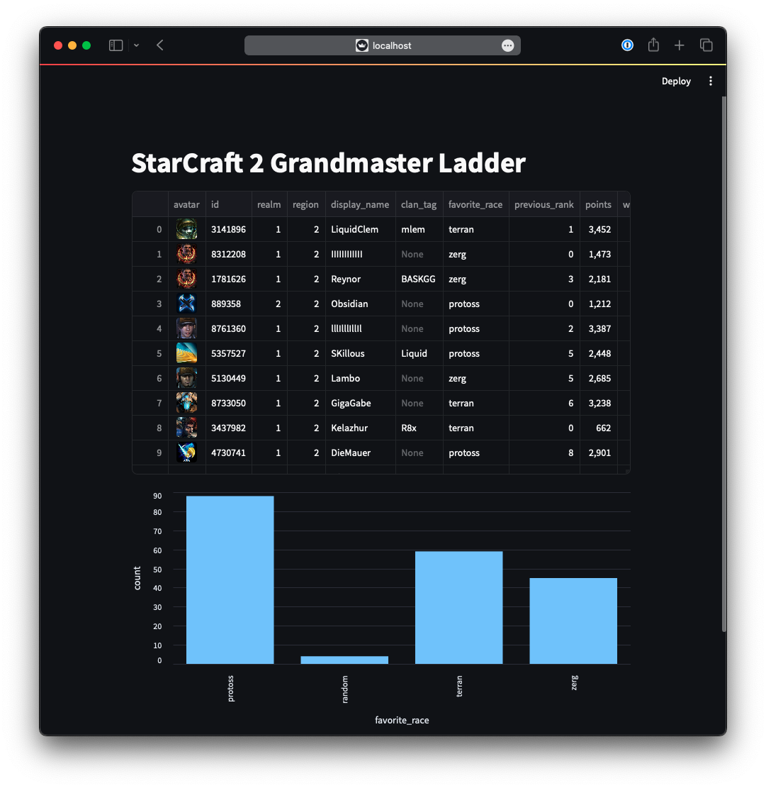

# StarCraft 2 Data Pipeline with Airflow, DuckDB and Streamlit


*Logo based on StarCraft II [press kit](https://blizzard.gamespress.com/starcraft)*

This project is not only a source for knowledge sharing but also a celebration of my love for gaming and the
endless possibilities that data holds. It is a fusion of our two great passions: gaming and Data Engineering. I grew up
playing StarCraft: Brood War as well as StarCraft II a lot. I never made it to the grandmaster ladder, but I enjoyed every
match experiencing the adrenaline rush of commanding armies, outmanoeuvring opponents, and claiming victory
(from time to time at least).

Just as I fine-tuned my build orders and adapt to enemy tactics in StarCraft, I am now optimizing data pipelines,
analyze trends, and visualize insights as a Data Engineer. In this project I would like to share knowledge about three
useful technologies of today's modern data stacks, which are namely:

* ⏱️ **[Apache Airflow](https://airflow.apache.org/)**: Platform for orchestrating and scheduling complex workflows.
* 🦆 **[DuckDB](https://duckdb.org/)**: Lightweight and versatile analytical database.
* 🚀 **[Streamlit](https://streamlit.io/)**: User-friendly framework for building interactive web applications.

This project is basically a StarCraft II data pipeline, where data is fetched from the StarCraft II API and stored in
DuckDB, orchestrated via Airflow. There is also a Streamlit app to visualize how the current grandmaster ladder
in StarCraft II looks like (spoiler: you will not find me in it).

In `playground.py` you find more examples how to utilize DuckDB and Pandas to analyze the data.

You can find more in my article: https://vojay.de/2024/03/14/starcraft-data-pipeline/

This is the final result:

## Airflow DAG



## Streamlit Dashboard



## Setup notes

```sh
# Create venv
python -m venv .venv
source .venv/bin/activate

# Install Airflow
AIRFLOW_VERSION=2.8.2
PYTHON_VERSION="$(python --version | cut -d " " -f 2 | cut -d "." -f 1-2)"
CONSTRAINT_URL="https://raw.githubusercontent.com/apache/airflow/constraints-${AIRFLOW_VERSION}/constraints-${PYTHON_VERSION}.txt"
pip install "apache-airflow==${AIRFLOW_VERSION}" --constraint "${CONSTRAINT_URL}"

# Run Airflow to initialize the database
NO_PROXY="*" AIRFLOW_HOME="$(pwd)/airflow" airflow standalone

# Install DuckDB
pip install duckdb

# Install Pandas and PyArrow
pip install pandas
pip install pyarrow

# Install Streamlit
pip install streamlit
```

* Create app at https://develop.battle.net/access/clients to get client ID and secret
* Add Airflow variable `client_id` with your client ID
* Add Airflow variable `client_secret` with your client secret
