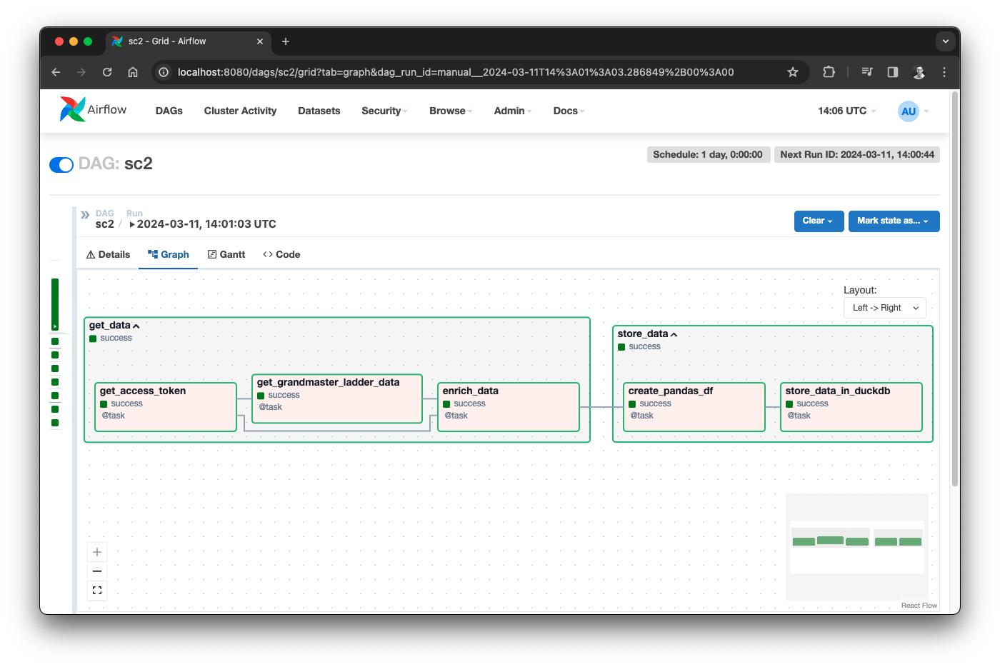

# StarCraft 2 Data Pipeline with Airflow, DuckDB and Streamlit

## Airflow DAG



## Streamlit Dashboard


## Setup notes

```sh
# Create venv
python -m venv .venv
source .venv/bin/activate

# Install Airflow
AIRFLOW_VERSION=2.8.2
PYTHON_VERSION="$(python --version | cut -d " " -f 2 | cut -d "." -f 1-2)"
CONSTRAINT_URL="https://raw.githubusercontent.com/apache/airflow/constraints-${AIRFLOW_VERSION}/constraints-${PYTHON_VERSION}.txt"
pip install "apache-airflow==${AIRFLOW_VERSION}" --constraint "${CONSTRAINT_URL}"

# Run Airflow to initialize the database
NO_PROXY="*" AIRFLOW_HOME="$(pwd)/airflow" airflow standalone

# Install DuckDB
pip install duckdb

# Install Pandas and PyArrow
pip install pandas
pip install pyarrow

# Install Streamlit
pip install streamlit
```

* Create app at https://develop.battle.net/access/clients to get client ID and secret
* Add Airflow variable `client_id` with your client ID
* Add Airflow variable `client_secret` with your client secret
